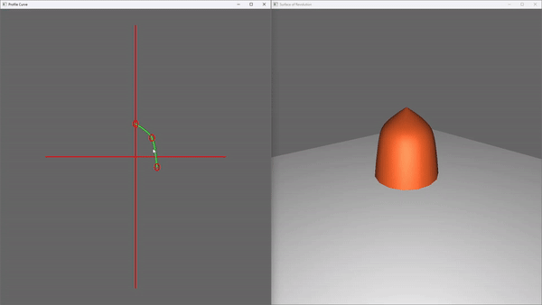

# 3D-Shape-Modeling-Program

---

## 🚀 Features

- **Interactive Profile Curve Editor**: 
  - Use the mouse to move control points and reshape the curve dynamically.
  - Adjust the number of control points (2–4) using the arrow keys.
  
- **3D Surface of Revolution Generation**:
  - Automatically rotates the profile curve around the y-axis to create a surface of revolution.
  - Control the resolution of the mesh by changing the rotation increment.

- **Mesh Scaling**:
  - Adjust the mesh's z-dimension scale using the right mouse button.
  - Fine control for creating thin or elongated shapes.

- **Camera Control**:
  - Rotate and elevate the camera around the mesh using mouse interactions.
  - Smooth navigation over an imaginary hemisphere for full 3D visualization.

- **Custom Viewing Transformation**:
  - Implements `myLookAt()` to replace `gluLookAt()`, providing a deeper understanding of camera transformations.

- **VBO-Based Rendering**:
  - Efficient rendering using Vertex Buffer Objects (VBOs) and `glDrawElements()`.
  - Support for triangle-based meshes for compatibility with modern OpenGL.

- **Mesh Exporting**:
  - Save your generated mesh as a `.obj` file using the 'W' key for use in future projects.

---

## 🖥️ Screenshots

---

## 📋 How to Use

### **Controls**  
#### **Profile Curve Window**
- **Move Control Points**: Drag with the mouse.
- **Add/Remove Control Points**: Use the arrow keys (Up/Down).  
#### **3D Mesh Window**
- **Adjust Z Scale**: Hold the right mouse button and move the mouse (limits: 0.1–1.5).  
- **Camera Rotation**:  
  - Rotate around the y-axis: Hold the left mouse button.  
  - Elevate camera: Hold **Shift** + left mouse button.  
#### **Other Controls**
- **Export Mesh**: Press **W** to save the mesh as `mesh.obj`.  

